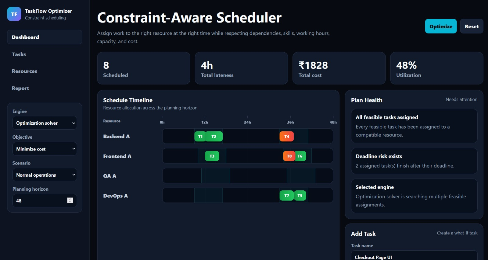
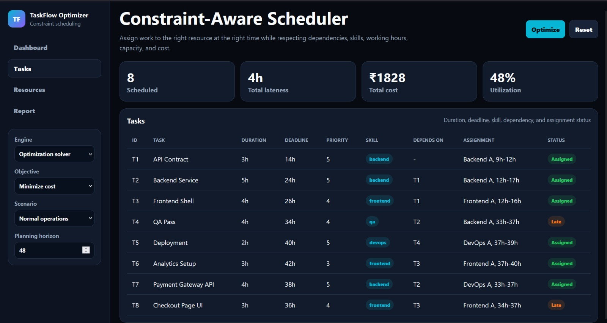
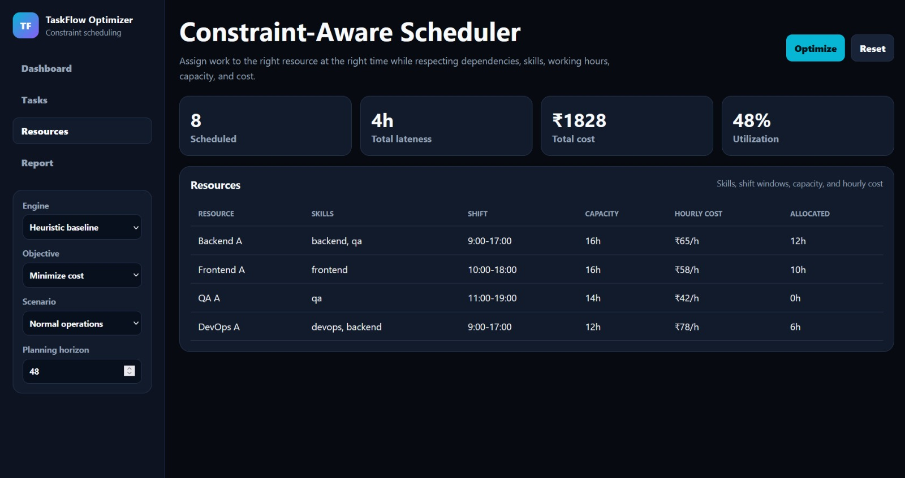
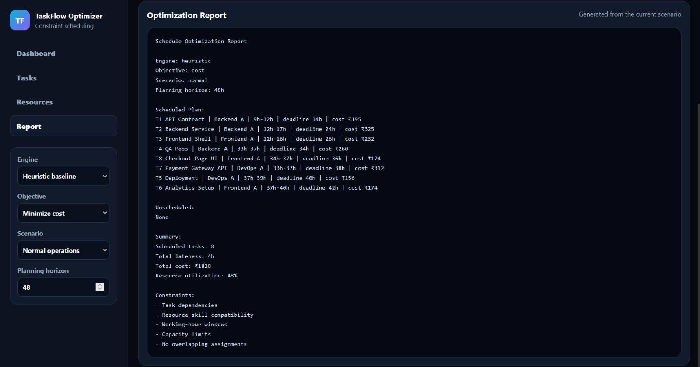
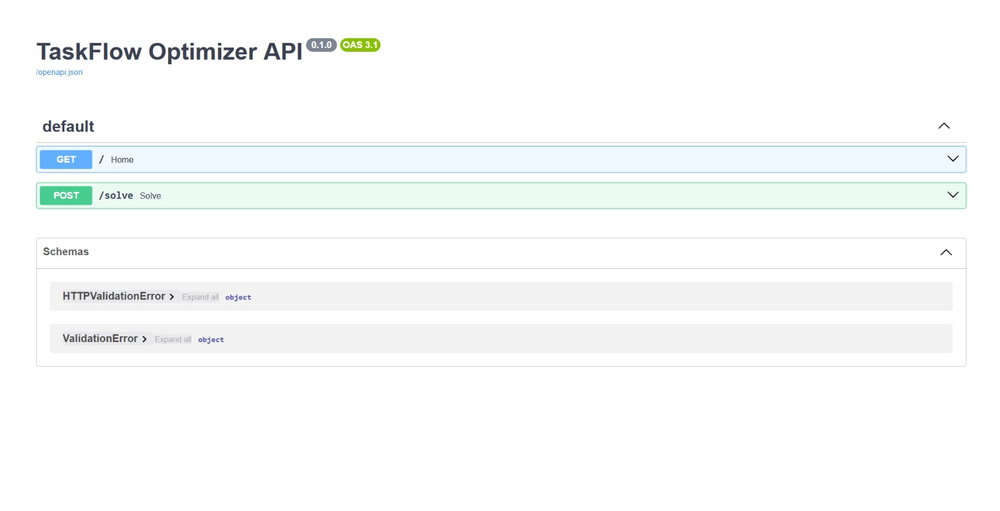
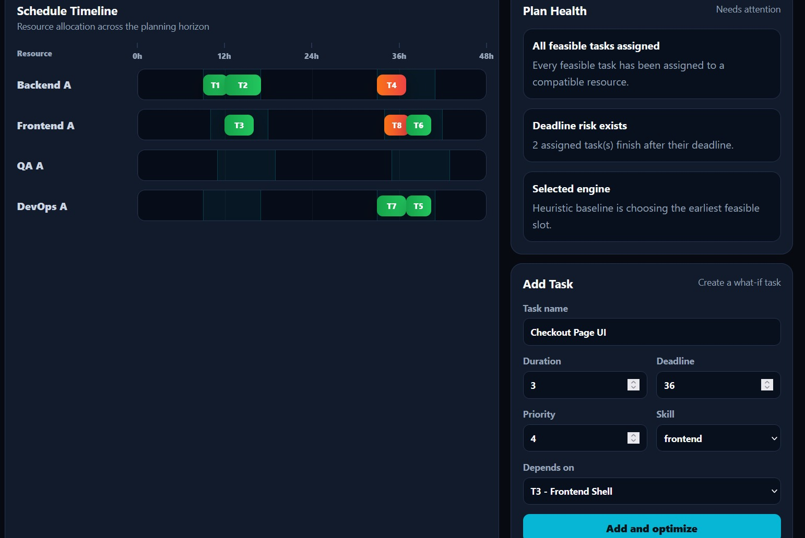

# TaskFlow Optimizer

TaskFlow Optimizer is a constraint-aware task scheduling system that assigns tasks to suitable resources and time slots while respecting dependencies, skills, working hours, resource capacity, and no-overlap rules.

The project includes a dark-mode web dashboard, a heuristic baseline scheduler, and a Python backend using Google OR-Tools CP-SAT for optimization.

## Features

- Constraint-aware task scheduling
- Resource and skill-based assignment
- Task dependency handling
- Working-hour rules
- Resource capacity limits
- No overlapping assignments per resource
- Lateness calculation
- Cost calculation in rupees
- Resource utilization tracking
- Heuristic baseline scheduler
- CP-SAT optimization solver
- What-if scenario dashboard
- Add custom task simulation
- Gantt-style schedule timeline
- Optimization report page

## Tech Stack

### Frontend
- HTML
- CSS
- JavaScript

### Backend
- Python
- FastAPI
- Google OR-Tools CP-SAT
- Uvicorn

## Project Structure

```text
Task-Scheduler-Optimization-System/
│
├── main.py                  ← old CLI main file
├── index.html               ← website frontend
│
├── src/                     ← CLI scheduler files
│
└── backend/
    ├── main.py              ← new backend API file
    ├── solver.py            ← CP-SAT solver logic
    └── requirements.txt

```
## How It Works
The frontend allows users to select scheduling settings, view tasks, resources, reports, and timeline results.

The backend receives task and resource data from the frontend and uses Google OR-Tools CP-SAT to generate an optimized schedule.

Frontend Dashboard
        ↓
FastAPI Backend
        ↓
OR-Tools CP-SAT Solver
        ↓
Optimized Schedule
        ↓
Dashboard Timeline and Report

## Scheduling Constraints
The scheduler respects the following constraints:

- A task can start only after its dependency is completed.
- A task can only be assigned to a resource with the required skill.
- A resource cannot handle overlapping tasks.
- Tasks must fit inside resource working-hour windows.
- Total assigned work must not exceed resource capacity.
- The schedule tries to minimize lateness and cost.

## Dashboard Pages
Dashboard
Shows the main schedule overview:

- Scheduled task count
- Total lateness
- Total cost
- Resource utilization
- Gantt-style timeline
- Plan health summary
- Add task form

## Tasks
Shows all tasks with:

- Task ID
- Duration
- Deadline
- Priority
- Required skill
- Dependency
- Assigned resource
- Status

## Resources
Shows all resources with:

 - Resource name
- Skills
- Shift timing
- Capacity
- Hourly cost
- Allocated hours

## Installation
1. Clone or Download Project
git clone https://github.com/YOUR_USERNAME/Task-Scheduler-Optimization-System.git
cd Task-Scheduler-Optimization-System
Or open the project folder manually.

2. Create Backend Virtual Environment
cd backend
python -m venv venv
3. Activate Virtual Environment
For Windows:

venv\Scripts\activate
For macOS/Linux:

source venv/bin/activate
4. Install Dependencies
python -m pip install -r requirements.txt
If requirements.txt is not available, install manually:

python -m pip install fastapi uvicorn ortools

## Running the Project
1. Start Backend Server
From the backend folder:

uvicorn main:app --reload
Backend will run at:

http://127.0.0.1:8000
To check backend:

http://127.0.0.1:8000

Expected response:

{
  "message": "TaskFlow Optimizer backend is running"
}
FastAPI docs:

http://127.0.0.1:8000/docs

2. Open Frontend
Open index.html in your browser.

Then choose:

Engine: Optimization solver
Objective: Balanced
Scenario: Normal operations
Planning horizon: 48

Click:

Optimize


## Example Output
Scheduled tasks: 6
Total lateness: 3h
Total cost: ₹1342
Resource utilization: 36%

## Example schedule:

T1 API Contract | Backend A | 9h-12h
T2 Backend Service | Backend A | 12h-17h
T3 Frontend Shell | Frontend A | 12h-16h
T4 QA Pass | Backend A | 33h-37h
T5 Deployment | DevOps A | 37h-39h
T6 Analytics Setup | Frontend A | 34h-37h

## Screenshots

## Dashboard



## Tasks Page


##  Resources Page


## Report Page


## FastAPI Backend


## What-if Task


## Backend API
GET /
Checks whether backend is running.

Response:

{
  "message": "TaskFlow Optimizer backend is running"
}

POST /solve
Runs the CP-SAT optimizer.

Request contains:

{
  "tasks": [],
  "resources": [],
  "horizon": 48,
  "objective": "hybrid"
}

Response contains:

{
  "status": "OPTIMAL",
  "plan": []
}


## Learning Outcomes
This project demonstrates:

- Constraint modeling
- Task scheduling logic
- Resource allocation
- Dependency management
- Optimization using Google OR-Tools
- Backend API development with FastAPI
- Frontend dashboard development
- What-if scenario simulation

## Future Improvements

- Store schedules in a database
- Add user authentication
- Add drag-and-drop task editing
- Add calendar view
- Export report as PDF
- Compare heuristic and CP-SAT results side by side
- Add multi-day calendar rules and holidays

## Author
Sakshi Ramakabal Maurya B.Tech in Information Technology at K.j. Somaiya institute of technology

